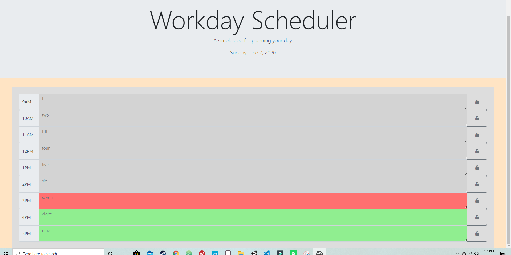

# Description of Workday Scheduler

## Link to Workday Scheduler

## https://proflonghair07.github.io/Homework_Week5/

## This workday scheduler consists of three files. An index.html, a style.css, and a script.js. It utilizes bootstrap, moment.js, fontawesome, and jquery.

## The index.html file heavily uses bootstrap to style its elements and to make them scalable depending on screen and window size. For the header a bootstrap jumbotron is used. Moment.js is used to render the current date to the second p element within the Jumbotron. For the input field bootstrap's input-group is used. Within the input group input-group-prepend is used to display the time of each field, a textarea is used for the input, and input-group-prepend is used for the lock buttons. The lock buttons contain and image of a lock that is rendered via fontawesome. The jquery and moment.js functionality is handled using an inline script within the index file. It is inside this script that the current date is printed to the header and the input field colors are changed depending on the time of day. The date is called from moment.js by creating a variable called today with a set value of moment(). It is printed to the Jumbotron using .text and customizing the format of the display date using moment.js syntax. The color changing of the textareas is all handled by one jquery function. This function creates a time variable that uses moment.js to render whatever hour of the day it is as a one or two digit number ranging 0 to 24. All of the conditionals change the color of the inputs by changing the class using .addClass. The first conditional is an if statement that changes all inputs to the past class if the value of time is greater than 17(which represents 5pm), or less than 9(which represents 9am). The rest of the conditionals are elese if statements that change the classes of the input fields if it is a specific hour of the day.

## The script.js file is where all of the saving of the input fields to local storage happens. At the start of the file all of the global variables are created. All of them call to the various lock buttons and textarea inputs. With the exception of the final function all the functions are identical in functionality, but just use different variables for different inputs and buttons. All functions have an event listener just before the function that listens to the corresponding lock button. The click function of the event listeners adds the user input to local storage using .setItem and runs the addInput functions associated with that button. The addInput functions create variables that get the input from the input field from local storge and display it as the placeholder text. The final function works much the same as all of the ones preceding it except it sets the input from local storage to the placeholder of all elements. The reason it does this is because this is the function that is used when the page is loaded and it renders all of the inputs from local storage to their corresponding textareas. This is acheived by using document.body.onload.

## Much of the styling is done via bootsrap but a some is done in the local stylesheet as well. Aside from a few tag selectors and class selectors that do some basic styling, there are three class selectors that are used to change the colors of the input field depending on the time of days. These three classes are called current, future, and past. They are added to the different textareas in the jquery script.
